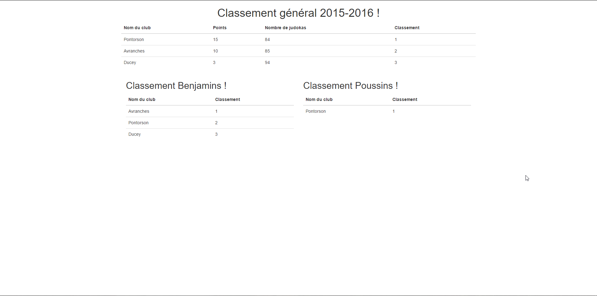

# Judoclub Ducey

Project created for managing the judoclub of Ducey.
Create the rankings for all categories (Poussin, Benjamin ...).
Get a general ranking with the different cities. 
Update the data for every meetings.




### Prerequisities

What you need to install.

```
Symfony
Composer
```

### Installing


Install the dependencies

```
php composer.phar update
```

Create your database and get the data

```
php bin/console doctrine:schema:update
php bin/console doctrine:fixtures:load
```

Run the server

```
php bin/console server:run
```


## Built With

* [`Symfony 3`](https://symfony.com/)
* [`BootStrap`](http://getbootstrap.com/)
* [`PhpStorm`](https://www.jetbrains.com/phpstorm/)

## Contributing

Please read [CONTRIBUTING.md](CONTRIBUTING.md) for details on our code of conduct, and the process for submitting pull requests to us.


## License

This project is licensed under the MIT License - see the [LICENSE.md](LICENSE.md) file for details

